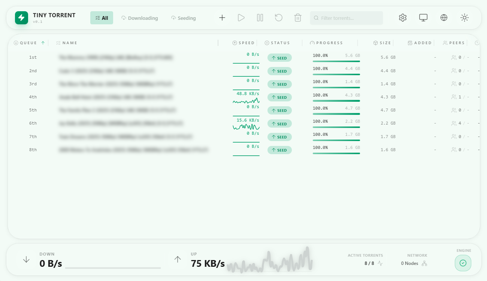
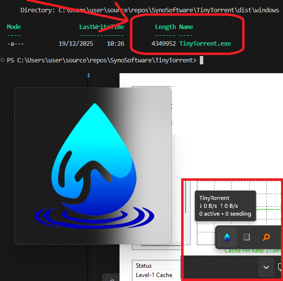
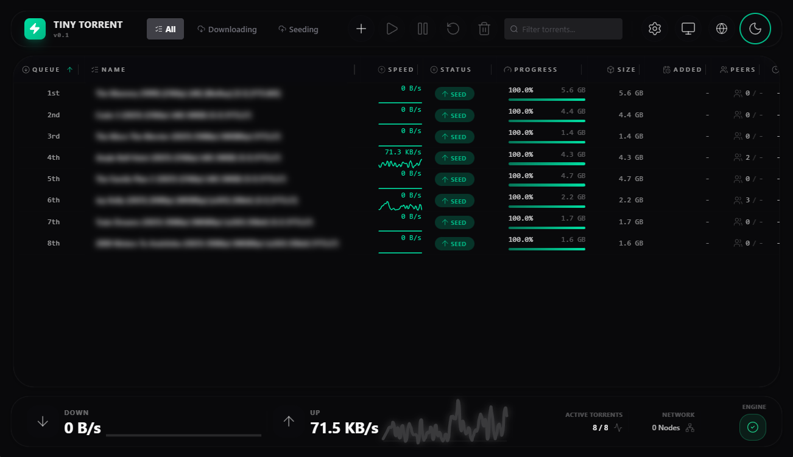

#  TinyTorrent

**A modern BitTorrent client. No frameworks needed. ~1 MB (Transmission-based) and ~3 MB (Libtorrent-based). Fully capable.**

[](https://www.mozilla.org/MPL/2.0/)
[](https://www.apache.org/licenses/LICENSE-2.0)
[](https://en.cppreference.com/w/cpp/20)
[](https://www.typescriptlang.org/)
[](https://react.dev/)
[](https://www.heroui.com/)
[](https://www.framer.com/motion/)
[](https://vitejs.dev/)
[]()
[]()
[]()
[]()

**Status:** Work in progress.  
Frontend runs against a standard `transmission-daemon`. Bugs exist; some features are unfinished and regressions may occur.  
Custom single-binary backend is under active development.

---

## 🧠 Motivation

I grew up with torrent clients that were **~160 KB** — small, fast, and engineered with real hardware limits in mind. That era is gone. Today even a simple tray application wastes memory it has no reason to touch, and I’m not fine with that. So I decided to do something about it.

My first idea was a pure C, bare-metal Windows client — no external libraries, just raw WinAPI. The UI was unacceptable, so I abandoned that approach. Later I realized that every modern system already ships with a fully optimized, GPU-accelerated rendering engine: the web browser. Used _on demand_, it delivers better visuals, less UI code, and zero idle UI memory.

This project exists to bring back what made the classics great: a lean core, a tiny binary, and a UI that feels modern — without abandoning engineering discipline.

**This is how TinyTorrent was born.**

Instead of dragging UI toolkits into the binary, TinyTorrent is split cleanly:

- **Native Tray Daemon:**  
  A minimal C/C++ executable responsible for lifecycle, tray controls (pause/resume/open GUI), and the torrent engine. Always running. No UI.

- **On-Demand GUI:**  
  A browser-based UI launched only when requested (Chrome, Edge, Firefox, etc.).  
  When closed, **no UI process exists**.

**Zero GUI memory when unused.**  
Exactly how it should be.

---




## 💎 Key Features

### Browser-Native HUD (frontend/)

- **Zero GUI memory when unused** — the interface is launched on demand in an external browser.
- **Glass Monolith UI** — Tailwind v4 + HeroUI + blur + depth for a stealth aesthetic.
- **Workspace Components**
  - **File Explorer Tree:** Nested, accordion-style file selection with priority toggling.
  - **Visualizers:** Real-time speed graphs, Disk Space Gauge, and peer maps.
- **Kinetic Motion** — Framer Motion used for structural transitions, not decoration.

### Backend-Agnostic Architecture

TinyTorrent is not tied to a single engine.

- **Strict RPC boundary:** The UI talks to a well-defined API.
- **Adapter Pattern:**
  - **Transmission Adapter:** Uses standard Transmission RPC.
  - **Libtorrent Adapter:** Planned C++ wrapper around `libtorrent-rasterbar`.

### Interaction Model

- **Queue Management:** Reorder torrents, move to top/bottom, drag-and-drop.
- **Deep Interaction:** Shift-click ranges, Ctrl-click toggles, full keyboard navigation.
- **Exact Typing:** No `any`. RPC schema is strictly typed and normalized.

---

## ⚖️ Licensing Rationale

TinyTorrent is licensed under **MPL-2.0** for the code because I want this project to stay true to the spirit that in my eyes made uTorrent great (small, practical, user-respecting), and to avoid the “uTorrent way” where a great tool drifts into a closed, adware/bloat-heavy direction.

MPL-2.0 is a pragmatic middle ground: it keeps the project open and encourages improvements to flow back when code is modified and redistributed, while still being compatible with real-world integration.

Notes:

- Repository license texts live at the repo root: `LICENSE` (MPL-2.0) and `APACHE-2.0`.
- Protocol/spec docs are **Apache-2.0**; branding assets are **proprietary/trademarked** (see the notices adjacent to those assets).

---

## 🏗 Repository Structure

```

TinyTorrent/
├── frontend/ # React 19 HUD, Vite build, Tailwind v4, HeroUI, Framer Motion
├── backend/ # C/C++ tray daemon + torrent engine
└── README.md # You are here

```

### Frontend Tech

- React 19
- TypeScript
- TailwindCSS v4
- HeroUI
- Framer Motion
- Vite

### Backend Tech

- C / C++20 (no exceptions, no RTTI)
- libtransmission
- Mongoose (embedded web server)
- Static asset bundling for optional embedded UI in the future

---

## 🚀 Getting Started

### Prerequisites

- Node.js 20+
- **Development:** You can run the frontend against a standard `transmission-daemon` (port 9091).

### Development (frontend)

```bash
cd frontend
npm install
npm run dev
```

> **Note:** The root and backend directories are intentionally TypeScript/Node-free. All `npm`/`npx` work happens inside `frontend/` so the native build tree stays clean. See `AGENTS.md` for the full rule set.

## Backend Note

The final TinyTorrent backend will not stay tied to the original Transmission daemon.
While the ~1 MB target is achievable only with Transmission’s engine, that code occasionally enters unrecoverable wait states. Because of this, we are developing a **Transmission-daemon–like backend implemented on top of the latest libtorrent**.

We will continue to **support Transmission RPC compatibility**, but the shipped executable will be our own daemon. It already implements the extensions defined in **rpc-tinytorrent-expanded**, which are required for our goals.

A static libtorrent build results in a larger binary — the current release-mode executable is ~9.5 MB and may reach ~10 MB as features stabilize (~3 MB when UPX packed, plus ~400 KB of gzipped JavaScript code). This is an acceptable tradeoff: **functionality takes priority over the size technical demonstration**, and the ~3 MB packaged footprint is more than good enough for the first production release.

For the full protocol and engine details, see:

- `docs/TinyTorrent_RPC_Extended.md`
- `docs/TinyTorrent_Specification.md`

---

## 🎨 Design Philosophy

Defined in **AGENTS.md** (root). That document also makes the rule explicit: only `frontend/` owns TypeScript and Node tooling, keeping the rest of the tree purely native.

1. Speed
2. Density
3. One Responsibility
4. Exact Typing
5. No entropy in the codebase

---

## 🤝 Contributing

Pull requests must follow the **Visual Excellence Directive**:

- Modern and consistent components
- Framer Motion for structural transitions
- Strict TypeScript
- No regressions in performance

---



**TinyTorrent** — _Simple. Fast. Beautiful. On-Demand._
