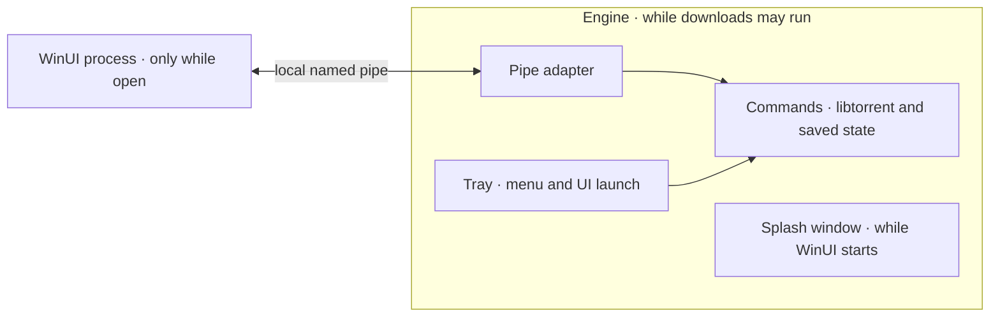

# TinyTorrent desktop architecture

Design decision, 2026-10-03. Scope: Windows only, local libtorrent, WinUI 3.
There will never be a macOS version, so do not add a seam for another platform.
This describes the target, not a completed migration or a measured size claim.
Implementation remains paused. Independent adversarial passes and subsequent
convergence reviews are recorded in [the review](desktop-architecture-review.md).
Project terms such as engine, pipe adapter, and protocol are defined in
[the glossary](../CONTEXT.md).

Runtime memory is the primary optimisation measure, especially during downloads
and seeding with WinUI closed. Correctness, durable downloads, essential features,
and useful transfer performance remain constraints. Executable and download size
are secondary. Every retained allocation or dependency must earn its memory cost;
useful caching is a tradeoff to justify, not an exemption from that scrutiny.

## The decision and its reason

Keep one program, the engine, running for downloads and the tray. Start a
separate WinUI process when the user opens the interface; let that process exit
when the interface closes. Connect the two with a local Windows named pipe
carrying a small, typed binary protocol.

The user has explicitly chosen local libtorrent only. Remote Transmission,
browser access, and interchangeable engines are outside this product's scope.
Their HTTP, JSON-RPC, WebSocket, authentication-token, and compatibility machinery
therefore have no job in the target application.

Two processes earn their cost because they let the UI disappear while downloads
continue. The tray does not need that separation: putting it inside the
engine removes supervision, endpoint discovery, and communication between two
always-running executables. Separate responsibilities do not require separate
processes.

The engine runs with the tray disabled for headless tests, using the same engine
implementation and startup composition. Its startup and shutdown do not require
WinUI, a window handle, or frontend files.

## Where the code lives

| Folder | Role |
| --- | --- |
| `engine/` | New project for the engine. It does not exist yet. |
| `winui3/` | Synapse, the paused Transmission client, and the new WinUI projects. |
| `backend/`, `frontend/` | The earlier TypeScript version: a C++ daemon and its web interface. Not touched. |

The engine is a new project, not a clean-up of `backend/`. Most of `backend/`
serves the HTTP/JSON server and the WebView host, which this design removes, so
a clean-up would delete most of the folder around the few parts worth keeping.

`backend/` and `frontend/` stay as they are: this work does not edit, build, or
delete them. Where this document says to remove or migrate legacy code, it
means the engine does not take that code. Nothing in `backend/` is precedent.
Its architecture, design, code, and build system must each justify themselves
against this document before the engine copies them.

In `winui3/`, Synapse stays as it is. The paused Transmission client is kept
and is not edited by this work. Build the WinUI program for the engine as new
projects beside it that reference Synapse. Copy a part of the paused client
into them only after judging it against this document.

## One owner for each decision

| Responsibility | Owner | What callers receive |
| --- | --- | --- |
| Torrent state, queueing, limits, file priorities, movement and deletion | Engine | Commands and immutable observations |
| Engine settings, resume data, and durable torrent identity | Engine | Validated changes and saved state |
| Process lifetime, tray, splash window, UI launch, and activation routing | Engine | A running instance and visible status |
| Preferences governing background behavior, including sign-in startup and direct addition | Engine | One saved setting, edited through its interface |
| Selected application language, shared by tray and WinUI | Engine | One language preference; local presentation renders it |
| Encoding, framing, cancellation, and connection failures | Pipe adapter | Typed requests and replies |
| Selection, sorting, drafts, dialogs, window state, and presentation | WinUI | A responsive interface |

These are responsibilities, not a prescription for five new classes. Keep work
together when it changes together. A forwarding class that adds no policy or
hides no complexity should disappear. A large file deserves a split when it
contains different decisions, not merely because it exceeds a line count.

Tray commands and pipe requests enter the same engine operations. The tray
does not call its own process through IPC. The pipe adapter decodes and checks a
request; the engine decides whether it is valid for the current torrent state.
Neither adapter reimplements download policy.

WinUI keeps display copies and unsaved edits. It does not maintain another engine
settings database or reconstruct torrent truth from successful button clicks.
Ordinary local UI actions, such as a file picker or opening Explorer, use Windows
directly. Actions that change engine-owned files go through the engine. There is
no separate host-agent process or universal operating-system broker.

## Product behavior that earns its place

Retain magnet and torrent-file addition, destination and file selection, paused
addition, duplicate detection, pause/resume, queue order, transfer and peer
limits, seeding policies, verification, relocation, and distinct remove versus
delete-data actions. Keep useful errors and on-demand files, peers, trackers,
pieces, and speed information, including tracker editing and reannounce. Retain
keyboard navigation, accessibility, shell activation, and resume after restart.

Libtorrent remains the sole metadata authority, including v1, v2, and hybrid
identity. WinUI renders its preview; it does not carry a second torrent parser.
A preview may fetch magnet metadata but must not start payload downloads before
confirmation. Cancel releases the pending preview, never an existing duplicate's
files. An explicitly chosen direct-add preference confirms the same engine
workflow without requiring WinUI. Accept or reject each forwarded activation
explicitly; bound pending additions rather than silently dropping them.
An unconfirmed preview belongs to its UI connection and is released on
disconnect; an accepted addition belongs to the engine and survives it. Transfer
activation ownership before the forwarding process exits, and check duplicates
again when confirming. Preserve full v1/v2 identities and hybrid aliases in
saved state; the existing 20-byte best-hash representation is insufficient.
Recover identity through libtorrent metadata/resume data during migration.
Preserve an old record whose identity cannot yet be recovered and report the
problem. On reconnect, WinUI retains preview inputs/edits but reacquires and
revalidates the engine's preview. If confirmation may have succeeded, reconcile
the torrent first; never reuse a stale preview ID.

Remote profiles, browser hosting, engine switching, and a search panel are out of
scope. Existing history, automation, and blocklist behavior require an identified
user need before retention or removal; existence alone is not justification.
This is a capability floor, not an invitation to add screens or new features.

### Localisation is part of the product

Every application-authored surface uses `en.json` as its English source and
fallback. Users can switch between shipped languages immediately in place,
including open application dialogs, owned controls, and the tray, without
restarting or losing edits. The engine owns the language preference;
each presentation surface renders the same catalogue contract. Windows-owned
dialogs retain platform-controlled language behavior.

Read [the localisation requirements](localisation.md) before changing user-facing
text, language selection, resource loading, or formatting. They own catalogue
layout, live refresh, fallback, culture rules, migration, and cost. JSON earns a
place as translation data; it does not replace the binary pipe protocol or require
a JSON parser in the tray runtime.

### Windows interface contract

Preserve the existing [Fluent standard](Fluent%202%20design%20and%20review%20standard%20for%20WinUI%203.md),
[table interaction/accessibility specification](../winui3/docs/torrent-table-specs.md),
and applicable [interface journeys](../winui3/docs/design-review.md). These own
native control semantics, UI Automation/Narrator, focus, contrast themes,
animation preferences, text scaling, and virtualization. They do not retain
superseded remote/Transmission features or broaden the testing policy. Use those
existing owners instead of creating another styling or accessibility system.

### Caching is a user setting

Use libtorrent **2.1.2 with its Windows memory-mapped disk implementation** as the
explicit configuration to validate, rather than an unspecified latest version.
This is a design selection, not a claim that the checkout already builds it.
Do not switch to the experimental pread backend just to obtain a numeric slider.

Expose **Disk write caching** in existing preferences: **Automatic**, **Buffered**, and
**Write-through**. Automatic resolves to the reviewed Windows default,
`disk_io_write_mode = write_through`; Buffered maps to `enable_os_cache`, and
Write-through explicitly retains `write_through`. Fix
`disk_write_mode = always_mmap_write` for this backend. These are write-cache
policies, not controls for seeding read-cache pressure or limits on total RAM.
Their source basis is the pinned
[defaults](https://github.com/arvidn/libtorrent/blob/v2.1.2/src/settings_pack.cpp),
[storage implementation](https://github.com/arvidn/libtorrent/blob/v2.1.2/src/mmap_storage.cpp),
and [Windows file flags](https://github.com/arvidn/libtorrent/blob/v2.1.2/src/file.cpp).

Engine settings own validation, application, and saving. Persist Automatic as a
policy, separately from explicit overrides; Reset restores it. Conservatively
apply policy changes on the next engine restart, so existing file handles do not
silently retain different behavior. Track requested, effective, and saved state
internally; show the choice, a restart indication when applicable, and useful
errors rather than a diagnostic dashboard. Restarting downloads requires a
deliberate user action.

Retire the old `disk_cache_mb` preference to Automatic with an explanation: its
obsolete mapping did not provide an equivalent budget. Do not claim all 2.x disk
backends lack an internal cache: the 2.1.2 pread implementation differs. A future
budget control must name the actual resource it governs and prove its effect.
Start from these upstream defaults. When implementing cache changes, check their
effect and restart behavior on the available machine, with a short comparable
transfer workload. Broader storage testing follows concrete problems or release
needs; it is not a hardware-lab prerequisite for development. If the choice
causes a regression, revisit it rather than building another cache around it.

## Pay only for dependencies with a job

Judge memory while the application does useful work, not just while idle. The
engine deserves the closest scrutiny because its cost persists
throughout downloads and seeding. WinUI's additional memory matters while open;
its process and the engine's UI-only work must disappear when closed. Prefer eliminating
unneeded work and retained copies before tightening buffers or peer limits that
support useful throughput. Keep application queues, observations, and retained
results bounded at their existing owners.

Sharing an installed runtime can reduce deployment duplication; it does not make
loading that runtime free. Moving code into DLLs does not by itself establish a
memory saving. Compare the complete running application for the same workload,
including its required processes, rather than optimizing the EXE size or a single
process's displayed number. Cache-policy names likewise do not prove a RAM limit.

The deliverable is the engine executable and an on-demand WinUI executable, plus
their justified runtime dependencies. A single-file bundle is not automatically
smaller or cheaper to run. The engine loads neither .NET nor WinUI.

| Dependency | Reason to retain or remove |
| --- | --- |
| libtorrent and required networking/crypto dependencies | Retain torrent correctness, interoperability, and speed; audit optional features individually. |
| Existing SQLite persistence | Retain while it owns required saved data; replacing it is a separate cost/benefit decision. |
| yyjson | Remove when actual consumers, including stored label serialization, are migrated or removed; changing IPC alone does not remove them. |
| Mongoose, WebView2, embedded frontend assets, Transmission | Remove with their displaced local communication, hosting, and engine paths. |
| .NET, WinUI, and used controls | Belong only to the disposable UI process. |
| Test frameworks and build tools | Build/test dependencies, not shipped runtime dependencies. |

Removing the local HTTP server does not remove libtorrent's HTTP(S) trackers or
web seeds. Preserve incoming peer connections and the meaning of limits in
release builds; substituting upload slots for peer limits or disabling inbound
TCP/uTP for size fails the product requirements.

Pin the dependency baseline and selected libtorrent features before validating
defaults or size. Audit transitive dependencies too. Use optimized release builds
and measured throughput; do not select size-oriented compiler or engine settings
blindly. Every application worker needs identifiable work and an idle wait;
thread counts follow blocking work, not a class-per-service convention.

## Why named pipes, and what they do not solve

A named pipe fits two local Windows processes and is available through Win32 and
.NET. It avoids a listening TCP port and a web-server dependency. It does not
remove serialization, validation, disconnects, or ambiguous command outcomes.
Those costs belong to having two processes, regardless of the transport.
See Microsoft's [named-pipe overview](https://learn.microsoft.com/en-us/dotnet/standard/io/how-to-use-named-pipes-for-network-interprocess-communication).

| Alternative | Reason to choose differently |
| --- | --- |
| One WinUI process with the engine as a C++ library | Fewer moving parts, but the UI runtime remains resident and a UI crash interrupts downloads. Reconsider only if those tradeoffs become acceptable. |
| HTTP with JSON | Useful for browser or remote clients. Neither is required here. |
| Shared memory | Consider only after profiling proves copying is the bottleneck; it also requires synchronization, lifetime management, and command signalling. |
| Windows RPC or COM | Reconsider if the pipe contract becomes harder to maintain than the generated interop it replaces. Platform availability alone does not justify that machinery. |

Use one duplex pipe connection for the UI, asynchronous I/O, and initially one
request awaiting a reply at a time. Keep operations short: queue long-running
engine work and report its state separately, so a file move cannot hold the
connection hostage. Launch forwarding may use a short-lived connection to the
same endpoint; it does not get a second protocol.
The duplex connection also carries bounded control notifications from
the engine for activation and close requests. One receive dispatcher distinguishes notifications
from replies. Draft resolution is asynchronous, allowing WinUI to send Save
before agreeing to close; it must not occupy the outstanding request slot.

After timeout or cancellation leaves a reply uncertain, discard that connection
before sending another request. A late reply must never become the next command's
result. Canceling the wait does not undo work already accepted by the engine.
Bound command queues and report overload. Optional refreshes yield to commands;
avoid a universal job registry just to implement that rule.

The protocol should define length-delimited messages, operation codes,
fixed-width integer fields, and length-prefixed UTF-8 strings and arrays. Specify
byte order and bounds explicitly. Encode fields, not C++ object memory or packed
struct layouts. Handle partial reads and writes, reject malformed lengths before
allocation, and keep the WinUI thread out of blocking I/O.

Define the contract once, beside its implementation, with shared byte fixtures
checked by both the C++ and C# codecs. Two language bindings are necessary;
independent interpretations of the contract are not. Start with the operations
the existing interface actually uses. Do not recreate the Transmission protocol,
introduce a schema compiler, or freeze speculative message layouts in this design.
Ship the two processes together and reject an incompatible protocol version
clearly instead of building version negotiation and compatibility adapters.

Scope the endpoint and instance ownership to the current user and Windows logon
session. Protect the pipe with an explicit ACL for that logon, reject remote
clients, and fail visibly if the endpoint cannot be secured or claimed. A pipe
name is not authentication. Windows documents the relevant
[access checks](https://learn.microsoft.com/en-us/windows/win32/ipc/named-pipe-security-and-access-rights)
and [creation flags](https://learn.microsoft.com/en-us/windows/win32/api/namedpipeapi/nf-namedpipeapi-createnamedpipew).
Use one engine owner per data directory as well, so a second logon cannot open
the same state concurrently. Same-user arbitrary code is outside this isolation
guarantee; adding another token does not make it a security boundary.
If another logon owns that directory, explain the conflict instead of launching
another engine or making the interface retry indefinitely.

## State and work stay with the engine

Libtorrent owns swarm and transfer execution. One owner in the engine consumes
its alerts and applies application commands. Do not invent a scheduler, event
bus, or task framework. Copy existing code and its queue from `backend/` only
where it passes the test in [Where the code lives](#where-the-code-lives).
Keep persistence and other blocking work off the tray and WinUI message loops.
Libtorrent already provides [asynchronous operations and resume-data alerts](https://www.libtorrent.org/tutorial.html).

Start with coherent summary snapshots while the UI is open and only the visible
detail section on demand. Collecting files must not also collect every peer and
piece. Large observations use bounded request/reply units that yield to commands
between units, not one enormous response split into network writes. Keep one
coherent active observation with bounded retention and release it on disconnect.
Discard unfinished observation pages after a mutation and fetch a new coherent
view, so an older page cannot overwrite its result. Small replies need no paging.
Allow at most one refresh in flight; refresh after a command and replace remote
observations after reconnecting, preserving selection, focus, and drafts by
stable identity. A removed selection gets predictable focus recovery. Stop UI refresh work when the
UI exits. Internal engine work continues independently. A slow or absent WinUI
must not block the engine or accumulate an unlimited backlog of updates.
The engine's UI-only snapshots, detailed statistics, and graph histories stop or are
released with their last consumer. Queue policy, swarm activity, useful tray
status, and persistence continue. Do not confuse stopping observation work with
pausing downloads or disabling useful libtorrent discovery and protocol support.

The engine finishes a snapshot before publishing it. Callers never observe a
snapshot that another thread is still filling. Do not add field-level patches,
replay logs, or multiple cache authorities merely to avoid sending a modest
summary. If realistic torrent counts make full summaries expensive, measure the
cost and reduce the payload at this owner before changing the architecture.

An accepted command is not necessarily a completed operation. Show pending work
until engine state confirms the result or reports failure. After a disconnect,
refresh state before retrying; never automatically replay destructive commands
whose outcome is unknown. Bind transient torrent identifiers to the connection's
engine session so a restart cannot turn an old identifier into another torrent.

Keep one persistence path. Use libtorrent's resume representation for libtorrent
state and retain existing application storage where it carries required data.
Replacing JSON on the communication path does not justify rewriting SQLite or
inventing a new settings format. Remove a dependency only after its remaining
real consumers have gone.

Checkpoint dirty state periodically while running, so recovery does not depend
on a successful final shutdown. One persistence owner orders writes and reports
storage completion; receiving a resume alert or queueing a write is not a saved
checkpoint. A late save must not resurrect a removed torrent or overwrite newer
state. Choose and test the checkpoint/flush policy against recovery loss and disk
cost. Keep writes and expensive serialization off libtorrent alert callbacks.
Confirm membership and settings mutations as saved only after their storage
commit succeeds. Periodic checkpoints may lose recent transfer progress after a
crash; a confirmed addition or removal must not vanish or return merely because
it was waiting for that timer. Reuse storage transactions, not a durable command
log. Deleting downloaded files has its own completion/failure result. Keep a
bounded completion result in the engine after its torrent row disappears,
available after UI reconnection while that engine instance lives. After an
engine crash an
unfinished result is unknown, not success; never blindly retry deletion against
a torrent that has been re-added.

The engine retains the affected storage claim while an asynchronous delete
or relocation is still active, even after the torrent row disappears. Reject
conflicting additions or moves with a useful pending/conflict result until that
work has settled; unrelated torrents continue. Check overlap with existing users
of the affected payload paths before starting destructive work as well. Release
the claim only on confirmed completion/failure, not on removal from the list or a
UI disconnect. Associate late completion and resume events with the original
torrent instance, so a re-added torrent cannot inherit them merely by sharing its
hash or path. Keep this state with the engine's operation owner; it does
not require a global scheduler or another storage framework. Libtorrent explicitly
allows [re-addition before all work on the old handle has ended](https://www.libtorrent.org/reference-Session.html#remove-torrent()).

## Lifetime must be obvious to the user

Opening TinyTorrent starts or activates the engine and opens WinUI.
An optional start-at-sign-in setting starts the engine with the UI
closed. Simultaneous launches resolve to one engine; later launches forward
their activation and exit. Readiness means the engine can answer, not merely
that a process or tray icon exists.
Reserve an in-progress UI launch before starting it asynchronously, so repeated
Open requests share one launch and one draft owner.

WinUI owns restoring its window against the current monitor work areas and DPI.
Saved coordinates are a preference, not proof that a display still exists: recover
a reachable position and usable size when monitors or scaling have changed.
Keep essential actions reachable at supported text scales and small supported
window sizes, with ordinary Windows movement/resizing intact. Use the existing
window-state owner and platform APIs, not another placement service.

The tray uses standard Win32 menu behavior, keyboard interaction, accessibility,
and system colors. Accept platform-owned menu appearance; matching the WinUI
theme does not justify undocumented theme hooks or custom menu rendering.

The splash window is the one accepted use of an undocumented call. The engine
draws it itself: a small acrylic window with the application icon and a short
message, using `SetWindowCompositionAttribute` and DWM attributes, with no UI
framework. The owner chose to keep it. The engine shows it while WinUI starts
and closes it when the WinUI window is visible or after a bounded wait. A
sign-in start with the UI closed does not show it. If the undocumented call is
missing, the window still appears, without the blur. Copy the technique from
`backend/src/tray/entry_winmain.cpp`, not the file. The splash window and the
tray menu are all the UI the engine owns.

Closing the WinUI window resolves drafts through the existing accessible
Save/Discard/Cancel interaction, then exits its process; downloads continue
under the tray icon. Tray **Exit** requests the same draft resolution while the
engine still accepts Save. Cancel leaves the application running. Only after UI
agreement does the engine stop accepting mutations and settle
accepted state changes and writes. Interrupt resumable verification or other long
work safely where supported; report work such as relocation that cannot yet
finish or stop safely. Keep status and necessary recovery actions available.
Quiesce transfers without overwriting the user's paused/running intent,
request final resume data with the required disk flush semantics, await storage
completion, then destroy/join libtorrent. Release data-directory ownership last.
A hung UI cannot block exit forever; report that condition and let the user
choose whether to discard its drafts. A short deadline does not justify killing
the engine during an operation that cannot be interrupted safely.

Windows logoff/shutdown has its own bounded persistence path and cannot depend
on an interactive confirmation. Abrupt termination may lose changes since the
last successful checkpoint; do not promise zero data loss. Report inability to
save rather than treating queued writes as success. The old preference to exit
the tray but leave a separate engine running has no place: the tray is part of the engine.

If WinUI crashes, downloads continue and the tray can reopen it. If
the engine fails, WinUI shows that downloads have stopped and offers a restart.
Without WinUI there is no resident watchdog: the user can relaunch the app.
This is an accepted cost of removing the extra supervisor. Explorer restarting
must cause the running engine to restore its tray icon.

## How to judge the migration

Use this design as an argument to test, not a checklist that overrides evidence.
For each proposed change, identify the user behavior it preserves, the owner it
clarifies, and the code or runtime cost it removes. If it adds more machinery
than it removes, explain the observed need before proceeding.

The useful first proof is a narrow end-to-end path: launch the engine,
connect WinUI, display real torrent state, perform a command, close the UI, and
reopen it while downloading continues. That exercise must include disconnects
and process exit. A pipe round-trip benchmark alone proves very little.

Keep the existing release recoverable while replacing the local path. Preserve
user downloads and saved state. During development an old build may remain a
reference; the final product has one engine and one local communication path.
The engine never takes on HTTP/JSON, Transmission, browser/WebView hosting,
unused installer machinery, or duplicate launch paths; they stay behind in
`backend/`. The paused Transmission client's source stays in the repository and
is not shipped. Do not ship a compatibility bridge simply to avoid finishing
the replacement.

### Proportionate validation on this machine

Follow the [testing policy](testing.md): seconds-long focused feedback by default,
no screen-string assertions or test per edit, and slower checks only where the
change warrants them. The scenarios below guide relevant validation; they are
not a suite to run after every small fix.

Design now using clear ownership, bounded retention, on-demand UI, and sensible
upstream defaults. Make straightforward memory-saving decisions from those
principles; measurements are not a prerequisite for accepting the design or
implementing each part. Keep correctness checks proportionate to the risk.

Measure at useful implementation milestones. Once the engine's download/seeding
path works, take one short memory/throughput check before building the remaining
UI around it; this is the opportunity to correct a costly dependency, lifetime,
or data-flow decision while it is still cheap to change. Finish with a focused
whole-app check when the intended functionality works, leaving time to fix what
it reveals before release. These checks do not require a benchmark framework.

For that final check, cover the engine's idle and active download/seeding memory with
WinUI closed, the added cost while it is open, and peaks during a representative
operation. Record resident working set and private committed
memory separately; distinguish mapped/file-cache effects and avoid double-counting
shared pages. Include throughput/CPU and UI startup to expose tradeoffs, with
release package size as a secondary measure. Include DLLs and required runtimes
in size accounting. Closing WinUI must leave no TinyTorrent UI process or retained
UI-only observations/history in the engine. Repeated open/close and language switching
must not leave accumulating retained state. Use this small baseline to identify
the largest avoidable costs, without inventing an MB promise before it exists.

Between milestones, repeat a resource check only for a concrete regression or a
change likely to materially affect memory or throughput, after related edits
settle. Routine edits do not trigger profiling. Lifecycle correctness still
needs relevant close/reopen and resume checks; UI scheduling or rendering changes
merit focused responsiveness checks. Cosmetic edits follow the testing policy.
Use the same machine
and similar conditions. A volatile public swarm is not a reliable throughput
baseline; use repeatable local input where practical. Synthetic data can exercise
large lists without requiring a second computer.

Near release, or when a fault points there, broaden coverage to simultaneous
launches, Unicode paths, malformed messages, write failures, remove/re-add races,
incoming seeding, actual peer limits, and shutdown during relocation. Protect
data integrity with focused tests as those paths change; do not defer a known
correctness defect just because broad testing comes later. No benchmark service,
hardware lab, or exhaustive matrix is required. Report this machine's evidence
and untested conditions honestly rather than promising universal optimality.

If this arrangement fails those checks, change the decision. In particular, a
growing custom serializer, expensive full snapshots, or unreliable lifecycle is
evidence to revisit the relevant choice, not a reason to add layers around it.

## Existing documents and implementation

This is the target authority for the local Windows product. The older
[EXE architecture](EXE%20architecture.md),
[v2 architecture](architecture/v2%20architecture.md), and
[refactored architecture](architecture/refactored%20architecuture.md) describe superseded
Transmission/browser designs. The old RPC specification describes the existing
HTTP implementation; it is not a requirement to reproduce that implementation
over a pipe. Root and component instructions now route runtime decisions here;
displaced HTTP/browser/tray-host rules and compulsory per-patch interface
extraction have been removed. Web tooling rules apply to `frontend/`, while
WinUI follows its own instructions. The testing policy owns validation scope
across these components. Legacy source may remain during migration; its presence
does not require retaining a second implementation in the finished product.

The source review found useful libtorrent code, mixed WebView/tray code, unused
installer wiring, and competing settings/snapshot responsibilities. It did not
establish release size, performance, or migration readiness. Production edits
started before the architecture-first request were withdrawn; this decision
does not imply that their identified bugs are fixed.

**Rename Candidates**

- `SessionService` → `Session`: it coordinates the libtorrent session;
  the owning namespace should supply the engine context.
- `SystemInstallService` → `Installation`, only if required installation behavior
  survives the scope review; deleting unused behavior takes priority over naming it.

These are review candidates, not instructions to rename or retain those types.
